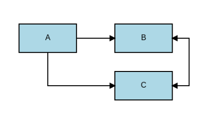

# Slidev Animations Addon

A powerful animation addon for [Slidev](https://github.com/slidevjs/slidev) presentations using Konva.js. Create stunning step-by-step animations, interactive diagrams, and dynamic visual content synchronized with your slide navigation.

<video src="https://github.com/user-attachments/assets/fdac54b7-6c54-4767-9fa1-9673c495c5ea" controls></video>

## Features

- **Step-by-Step Animations**: Synchronized with Slidev's click navigation system
- **Generator-Based Syntax**: Clean, readable animation code using generator functions
- **Rich Easing Library**: Bounce, elastic, back, and more built-in easing functions
- **Block & Connection System**: Create dynamic flowcharts and diagrams
- **Property Animations**: Animate position, scale, rotation, opacity, color, and more
- **Simultaneous Animations**: Execute multiple animations in parallel with `step()`
- **Smart Performance**: Automatic animation skipping for rapid navigation
- **TypeScript Support**: Fully typed with comprehensive type definitions

## Technology Stack

- **Animation Engine**: Custom-built animation system with Konva.js integration
- **Graphics**: [Konva](https://konvajs.org/) 2D canvas library with [Vue-Konva](https://github.com/konvajs/vue-konva)
- **Framework**: Vue 3 with Composition API and TypeScript
- **Testing**: Vitest with comprehensive test coverage
- **Package Manager**: Bun for fast dependency management
- **Code Quality**: Biome for linting and formatting

## Installation

### Basic Setup

Install the addon in your Slidev project:

```bash
# Using npm
npm install git+https://github.com/DCC-BS/slidev-addon-animations.git 

# Using bun
bun add git+https://github.com/DCC-BS/slidev-addon-animations.git 
```

### Add to Slidev Configuration

Add the addon to your `slides.md` frontmatter:

```yaml
---
theme: default
addons:
  - slidev-addon-animations
---
```

## Quick Start

### Basic Animation Example

```vue
<script setup lang="ts">
import {
    animate,
    EasingPresets,
    moveTo,
    scaleTo,
    step,
} from "slidev-addon-animations";
import { ref } from "vue";

const circle = ref({ x: 100, y: 100, radius: 30, fill: "red" });

function* myAnimation() {
    // Step 1: Move and scale simultaneously
    yield step(
        moveTo(circle, 200, 150, { duration: 1000 }),
        scaleTo(circle, 1.5, { easing: EasingPresets.bounceOut }),
    );

    // Step 2: Change color
    yield animate(circle, { fill: "blue" }, { duration: 500 });
}
</script>

<template>
    <Animator :generator="myAnimation">
    </Animator>
    <v-stage :width="400" :height="300">
      <v-layer>
          <v-circle :config="circle" />
      </v-layer>
    </v-stage>
</template>
```

<video src="https://github.com/user-attachments/assets/7eef102f-5146-4049-ba39-04909007e615" controls></video>

### Block & Connection System

```vue
<script setup lang="ts">
import type { BlockConfig, ConnectionOptions } from "slidev-addon-animations";
import { computed, ref } from "vue";

const blockA = ref<BlockConfig>({
    x: 50,
    y: 100,
    width: 120,
    height: 60,
    text: "A",
});

const blockB = ref<BlockConfig>({
    x: 250,
    y: 100,
    width: 120,
    height: 60,
    text: "B",
});

const blockC = ref<BlockConfig>({
    x: 250,
    y: 200,
    width: 120,
    height: 60,
    text: "C",
});

const connectionAB = computed<ConnectionOptions>(() => ({
    fromShape: blockA.value,
    toShape: blockB.value,
    fromAnchor: "right",
    toAnchor: "left",
    connectionType: "straight",
    lineType: "arrow",
}));

const connectionAC = computed<ConnectionOptions>(() => ({
    fromShape: blockA.value,
    toShape: blockC.value,
    fromAnchor: "bottom",
    toAnchor: "left",
    connectionType: "orthogonal",
    lineType: "arrow",
}));

const connectionBC = computed<ConnectionOptions>(() => ({
    fromShape: blockB.value,
    toShape: blockC.value,
    fromAnchor: "right",
    toAnchor: "right",
    connectionType: "curved",
    lineType: "double-arrow",
}));
</script>

<template>
    <v-stage :width="600" :height="300">
        <v-layer>
            <Block :config="blockA" />
            <Block :config="blockB" />
            <Block :config="blockC" />
            <Connection :config="connectionAB" />
            <Connection :config="connectionAC" />
            <Connection :config="connectionBC" />
        </v-layer>
    </v-stage>
</template>
```



### Animated Connections

The animation system works seamlessly with Vue's reactivity. When you animate reactive references, any computed values depending on them automatically update, making dynamic connections possible:

```vue
<script setup lang="ts">
import { animate, type BlockConfig, type ConnectionOptions } from "slidev-addon-animations";
import { computed, ref } from "vue";

// create a reactive reference for the y-coordinate of block B
const blockBY = ref(100);

// block A will be a static block with fixed coordinates so we can use a simple object
const blockA = {
    x: 50,
    y: 100,
    width: 120,
    height: 60,
    text: "Block",
} as BlockConfig;

// create a computed reference for block B that uses the reactive reference
const blockB = computed<BlockConfig>(() => ({
    x: 250,
    y: blockBY.value,
    width: 120,
    height: 60,
    text: "Block",
}));

// create a computed reference for the connection options between block A and block B
const connection = computed<ConnectionOptions>(() => ({
    fromShape: blockA,
    toShape: blockB.value,
    type: "curved",
    fromAnchor: "right",
    toAnchor: "left",
    connectionType: "orthogonal",
    lineType: "double-arrow",
}));

function* myAnimation() {
    yield animate(blockBY, 200, { duration: 1000 });
}
</script>

<template>
    <Animator :generator="myAnimation" />
    <v-stage :width="400" :height="300">
        <v-layer>
            <Block :config="blockA" />
            <Block :config="blockB" />
            <Connection :config="connection" />
        </v-layer>
    </v-stage>
</template>
```

<video src="https://github.com/user-attachments/assets/f4f95cc7-0277-4834-b8f1-1e9b18697baa" controls></video>

**Key Benefits of Computed Values:**
- **Automatic Updates**: When `blockBY` is animated, the computed `blockB` automatically recalculates
- **Dynamic Connections**: The `connection` computed property updates in real-time as block positions change
- **Reactive Chains**: Changes propagate through the entire reactive dependency graph
- **Performance**: Vue's reactivity system ensures only necessary updates are triggered

This approach enables smooth, synchronized animations where connections automatically adjust as blocks move, creating fluid and professional-looking animated diagrams.

## Development

### Setup Development Environment

Make sure to install dependencies:

```bash
# Using bun (recommended)
bun install

# Using npm
npm install
```

### Start Development Server

Preview the example slides with hot reload:

```bash
# Using bun (recommended)
bun run dev

# Using npm
npm run dev
```

This will start Slidev with the `example.md` presentation showcasing all features.

### Build and Export

Build presentation for production:

```bash
# Using bun
bun run build

# Using npm
npm run build
```

Export as PDF:

```bash
# Using bun
bun run export

# Using npm
npm run export
```

Generate screenshot preview:

```bash
# Using bun
bun run screenshot

# Using npm
npm run screenshot
```

## Testing & Quality Assurance

Run comprehensive test suite:

```bash
# Run all tests
bun test        # or: npm test

# Run tests with UI
bun test:ui     # or: npm run test:ui

# Run tests in watch mode
bun test:watch  # or: npm run test:watch

# Generate coverage report
bun test:coverage  # or: npm run test:coverage

# Run specific test examples
bun test:examples  # or: npm run test:examples
```

Check code quality with Biome:

```bash
# Lint and format
bun run lint    # or: npm run lint

# Check for issues
bun run check   # or: npm run check
```

## API Reference

### Core Composables

#### `useKonvaAnimation(targets, options)`

Main composable for creating animations with fine-grained control.

```typescript
const { currentStep, totalSteps, isAnimating, animateToStep } = useKonvaAnimation(
  animationTargets,
  {
    skipThreshold: 300,
    defaultDuration: 1000,
    defaultEasing: EasingPresets.easeInOut
  }
)
```

#### `useGeneratorAnimation(options)`

High-level composable with generator-based animation syntax.

```typescript
const { createAnimationFromGenerator, animate, moveTo, scaleTo } = useGeneratorAnimation({
  skipThreshold: 300,
  defaultDuration: 1000,
  defaultEasing: 'easeInOut'
})
```

### Animation Helper Functions

#### Core Animation Functions

- **`animate(target, properties, options)`** - Animate any properties on objects
  - `target: unknown | Ref<unknown>` - The target object or reactive reference to animate
  - `properties: Record<string, unknown>` - Object containing properties to animate and their target values
  - `options?: AnimationProps` - Optional animation configuration

- **`animate(target, value, options)`** - Animate ref primitive values directly  
  - `target: Ref<unknown>` - The reactive reference containing a primitive value
  - `value: unknown` - The target value to animate to
  - `options?: AnimationProps` - Optional animation configuration

- **`animateValue(target, value, options)`** - Explicit helper for animating ref values
  - `target: Ref<unknown>` - The reactive reference to animate
  - `value: unknown` - The target value to animate to
  - `options?: AnimationProps` - Optional animation configuration

#### Shape Animation Functions

- **`moveTo(target, x, y, options)`** - Move to position
  - `target: Ref<ShapeConfig> | ShapeConfig` - The shape object or reactive reference
  - `x: number` - Target x coordinate
  - `y: number` - Target y coordinate
  - `options?: AnimationProps` - Optional animation configuration

- **`scaleTo(target, scale, options)`** - Scale uniformly or per-axis
  - `target: Ref<ShapeConfig> | ShapeConfig` - The shape object or reactive reference
  - `scale: number | { x: number; y: number }` - Uniform scale factor or separate x/y scales
  - `options?: AnimationProps` - Optional animation configuration

- **`rotateTo(target, rotation, options)`** - Rotate to angle
  - `target: Ref<ShapeConfig> | ShapeConfig` - The shape object or reactive reference
  - `rotation: number` - Target rotation angle in radians
  - `options?: AnimationProps` - Optional animation configuration

- **`resizeTo(target, width, height, options)`** - Resize to dimensions
  - `target: Ref<ShapeConfig> | ShapeConfig` - The shape object or reactive reference
  - `width: number` - Target width
  - `height: number` - Target height
  - `options?: AnimationProps` - Optional animation configuration

- **`fadeTo(target, opacity, options)`** - Fade to opacity
  - `target: Ref<ShapeConfig> | ShapeConfig` - The shape object or reactive reference
  - `opacity: number` - Target opacity (0-1)
  - `options?: AnimationProps` - Optional animation configuration

- **`show(target, options)`** - Fade in to full opacity
  - `target: Ref<ShapeConfig> | ShapeConfig` - The shape object or reactive reference
  - `options?: AnimationProps` - Optional animation configuration

- **`hide(target, options)`** - Fade out to transparent
  - `target: Ref<ShapeConfig> | ShapeConfig` - The shape object or reactive reference
  - `options?: AnimationProps` - Optional animation configuration

#### Animation Grouping

- **`step(...animations)`** - Group animations to run simultaneously
  - `...animations: AnimationInstruction[]` - Variable number of animation instructions
  - Returns: `AnimationInstruction[]` - Array of animation instructions

#### AnimationProps Interface

```typescript
interface AnimationProps {
  duration?: number;    // Animation duration in milliseconds (default: 1000)
  delay?: number;       // Delay before animation starts in milliseconds (default: 0)
  easing?: EasingFunction | EasingPreset; // Easing function or preset name
}
```

### Components

#### `<Animator>` - Generator-based Animation Controller

Manages the execution of generator-based animations synchronized with Slidev's navigation.

**Props:**
- **`generator?: () => AnimationGeneratorFunction`** - Function that returns the animation generator
- **`skipThreshold?: number`** - Time threshold in ms for skipping animations (default: 300)
- **`defaultDuration?: number`** - Default animation duration in ms (default: 1000)
- **`defaultEasing?: string`** - Default easing preset name (default: "easeInOut")

**Usage:**
```vue
<Animator 
  :generator="myAnimationGenerator"
  :skipThreshold="200"
  :defaultDuration="800"
  defaultEasing="bounceOut"
/>
```

#### `<Block>` - Rectangular Blocks with Text Labels

Renders rectangular blocks with customizable appearance and text content.

**Props (BlockConfig):**
- **`x?: number`** - Horizontal position
- **`y?: number`** - Vertical position  
- **`width?: number`** - Block width
- **`height?: number`** - Block height
- **`text?: string`** - Text content to display
- **`scaleX?: number`** - Horizontal scale factor (default: 1)
- **`scaleY?: number`** - Vertical scale factor (default: 1)
- **`opacity?: number`** - Opacity level 0-1 (default: 1)
- **`rotation?: number`** - Rotation angle in radians (default: 0)
- **`offsetX?: number`** - Horizontal offset for transformations
- **`offsetY?: number`** - Vertical offset for transformations
- **`offset?: { x: number; y: number }`** - Alternative offset specification
- **`rectConfig?: Partial<RectConfig>`** - Additional Konva rectangle properties
- **`textConfig?: Partial<TextConfig>`** - Additional Konva text properties

**Usage:**
```vue
<Block :config="{
  x: 100, y: 50, width: 120, height: 60,
  text: 'My Block', opacity: 0.8,
  rectConfig: { fill: 'lightblue', stroke: 'navy' },
  textConfig: { fontSize: 18, fill: 'darkblue' }
}" />
```

#### `<Connection>` - Dynamic Connections Between Shapes

Creates dynamic lines, arrows, and curves connecting shapes with automatic anchor point calculation.

**Props (ConnectionOptions):**
- **`fromShape: Shape`** - Source shape object
- **`toShape: Shape`** - Target shape object  
- **`fromAnchor: AnchorPoint`** - Connection point on source ("left" | "right" | "top" | "bottom" | "center")
- **`toAnchor: AnchorPoint`** - Connection point on target ("left" | "right" | "top" | "bottom" | "center")
- **`connectionType: ConnectionType`** - Line style ("straight" | "curved" | "orthogonal")
- **`lineType: LineType`** - Line ending ("line" | "arrow" | "double-arrow")
- **`config?: ConnectionConfig`** - Optional styling configuration

**ConnectionConfig Properties:**
- **`stroke?: string`** - Line color (default: "black")
- **`strokeWidth?: number`** - Line thickness (default: 2)
- **`dash?: number[]`** - Dash pattern for dashed lines
- **`fill?: string`** - Fill color for arrows
- **`pointerLength?: number`** - Arrow head length
- **`pointerWidth?: number`** - Arrow head width  
- **`tension?: number`** - Curve tension for curved connections
- **`cornerRadius?: number`** - Corner radius for orthogonal connections
- **`opacity?: number`** - Connection opacity 0-1

**Usage:**
```vue
<Connection :config="{
  fromShape: blockA, toShape: blockB,
  fromAnchor: 'right', toAnchor: 'left',
  connectionType: 'curved', lineType: 'arrow',
  config: { stroke: 'blue', strokeWidth: 3, tension: 0.5 }
}" />
```

### Easing Functions

Available easing presets: `linear`, `easeIn`, `easeOut`, `easeInOut`, `bounceIn`, `bounceOut`, `bounceInOut`, `elasticIn`, `elasticOut`, `elasticInOut`, `backIn`, `backOut`, `backInOut`, `strongIn`, `strongOut`, `strongInOut`

## Project Architecture

The slidev-addon-animations project follows a modular, TypeScript-first architecture designed for maintainability, testing, and extensibility.

### Core Structure

```
slidev-addon-animations/
├── 📁 components/              # Vue components for UI elements
│   ├── Animator.vue           # Generator-based animation controller
│   ├── Block.vue              # Rectangular block component  
│   ├── Connection.vue         # Dynamic connection lines
│   └── Graphic.vue            # Konva stage wrapper
│
├── 📁 composables/            # Reusable animation logic
│   ├── useKonvaAnimation.ts   # Core animation system with step control
│   └── useGeneratorAnimation.ts # High-level generator-based animations
│
├── 📁 types/                  # TypeScript type definitions
│   ├── animation.ts           # Core animation system types
│   ├── block.ts              # Block component types
│   ├── componentProps.ts     # Vue component prop interfaces
│   ├── generatorAnimation.ts # Generator animation types
│   ├── graphic.ts            # Graphic component types
│   ├── lerpSystem.ts         # Interpolation system types
│   ├── shapeConnector.ts     # Shape connection types
│   └── index.ts              # Unified type exports
│
├── 📁 utils/                  # Animation engine utilities
│   ├── animationEngine.ts    # Core animation processing & timing
│   ├── animationHelpers.ts   # Helper functions for creating animations
│   ├── constants.ts          # Shared constants and configurations
│   ├── lerpSystem.ts         # Value interpolation system
│   └── shapeConnector.ts     # Connection geometry calculations
│
├── 📁 setup/                  # Slidev integration
│   └── main.ts               # Slidev plugin setup and registration
│
├── 📁 tests/                  # Comprehensive test suite
│   ├── animationEngine.test.ts    # Core animation engine tests
│   ├── animationHelpers.test.ts   # Helper function tests
│   ├── examples.test.ts           # Integration example tests
│   ├── generatorBug.test.ts       # Generator-specific bug tests
│   ├── helpers.ts                 # Test utility functions
│   ├── integration.test.ts        # End-to-end integration tests
│   ├── lerpSystem.test.ts         # Interpolation system tests
│   ├── refPrimitiveAnimation.test.ts # Ref primitive animation tests
│   ├── setup.ts                   # Test environment setup
│   ├── stepDelays.test.ts         # Step delay timing tests
│   └── types.d.ts                 # Test-specific type definitions
│
├── 📁 .github/                # GitHub workflows and automation
│   └── workflows/             # CI/CD pipeline definitions
│
├── 📄 index.ts                # Main entry point and exports
├── 📄 package.json            # Package configuration and dependencies
├── 📄 example.md              # Live example presentation
├── 📄 vitest.config.ts        # Test configuration
├── 📄 biome.json              # Code quality and formatting rules
└── 📄 README.md               # This documentation
```

### Architecture Principles

#### 🎯 **Separation of Concerns**
- **Components**: Pure UI presentation layer
- **Composables**: Reusable business logic  
- **Utils**: Core algorithms and calculations
- **Types**: Comprehensive type safety

#### 🔄 **Reactive Design**
- Vue 3 Composition API throughout
- Reactive references for real-time updates
- Computed properties for derived state
- Watch effects for side effects

#### 🧪 **Test-Driven Development**
- Comprehensive unit test coverage
- Integration tests for complex workflows
- Performance benchmarks for animations
- Example-based testing for user scenarios

#### 📦 **Modular Export System**
- Clean public API through `index.ts`
- Tree-shakable imports
- TypeScript-first design
- Consistent naming conventions

### Key Design Patterns

#### **Generator-Based Animation**
```typescript
// Clean, readable animation sequences
function* myAnimation() {
  yield moveTo(shape, 100, 200);
  yield scaleTo(shape, 1.5);
  yield step(
    fadeTo(shapeA, 0),
    fadeTo(shapeB, 1)
  );
}
```

#### **Reactive Connection System**
```typescript
// Connections automatically update when shapes move
const connection = computed(() => ({
  fromShape: blockA.value,
  toShape: blockB.value,
  // ... connection config
}));
```

#### **Type-Safe Animation Targets**
```typescript
// Full TypeScript support for all animation properties
const target: AnimationTarget = {
  target: shapeRef.value,
  steps: [...],
  initialState: { x: 0, y: 0 }
};
```

### Performance Optimizations

- **Animation Skipping**: Rapid navigation detection
- **Shallow Reactivity**: Optimized ref usage
- **Batched Updates**: Microtask scheduling
- **Memory Management**: Proper cleanup and disposal

## Advanced Usage

### Custom Easing Functions

```javascript
const customEasing = (t, b, c, d) => {
  // Custom easing implementation
  return c * t / d + b
}

yield animate(target, { x: 100 }, { 
  duration: 1000, 
  easing: customEasing 
})
```

### Complex Animation Sequences

```javascript
function* complexAnimation() {
  // Parallel animations with different timings
  yield step(
    moveTo(obj1, 200, 100, { duration: 1000 }),
    scaleTo(obj2, 1.5, { duration: 800, delay: 200 }),
    fadeTo(obj3, 0.5, { duration: 600, delay: 400 })
  )
  
  // Sequential with staggered delays
  yield step(
    ...elements.map((el, i) => 
      animate(el, { opacity: 1 }, { 
        duration: 500, 
        delay: i * 100 
      })
    )
  )
}
```

### Dynamic Connections

```javascript
const connectionOpacity = ref(0);

const connection = computed(() => ({
  fromShape: blockA.value,
  toShape: blockB.value,
  connectionType: 'curved',
  config: {
    stroke: 'blue',
    strokeWidth: 3,
    opacity: connectionOpacity.value
  }
}))

// Animate connection appearance
yield animate(connectionOpacity, 1, { duration: 600 })
```

## Contributing

1. **Fork and clone** the repository
2. **Install dependencies**: `bun install` or `npm install`
3. **Start development**: `bun run dev` or `npm run dev`
4. **Run tests**: `bun test` or `npm test`
5. **Check code quality**: `bun run check` or `npm run check`
6. **Submit pull request** with your improvements

### Development Guidelines

- Write tests for new features
- Follow TypeScript best practices
- Use Biome for code formatting
- Document new APIs and components
- Update example.md to showcase new features

## License

[MIT](LICENSE) © Data Competence Center Basel-Stadt

<a href="https://www.bs.ch/schwerpunkte/daten/databs/schwerpunkte/datenwissenschaften-und-ki"></a>

Datenwissenschaften und KI <br>
Developed with ❤️ by Data Alchemy Team
